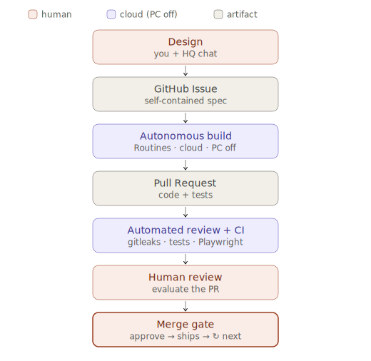
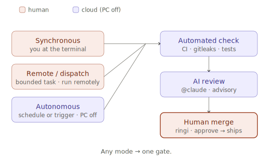

# ringi-driven-harness

> Claude のための「人間がゲートに立つ」ハーネス。コーディングエージェントが本番品質のソフトウェアを — あなたの傍らで、外出中に、あるいは眠っている間に — 構築し、すべての変更は一つのゲートに収束して、何をリリースするかは最終的に人間が握ります。エージェントの群れが安価になるほど、希少なのはこのガバナンスの層です。

[English](README.md) · **日本語**

## 概要

ringi-driven-harness は、Claude Code で実際に動くソフトウェアを開発するための方法論であり、開発者一人がコーディングエージェントを統括するための「ユーザーハーネス」です。GitHub を通じて自律的なエージェントを動かしつつ、`main` に到達するすべての変更の手前に、人間による承認のゲート（稟議）を置きます。

これは [ringi-driven-dev](https://github.com/seunghwan-dev/ringi-driven-dev) の発展形です。v1 は同期型で、開発者がキーボードの前に座っている必要がありました。v2 は非同期型で、あなたが職場にいる間や就寝中にクラウド上で作業が進み、戻ってきたときに結果を確認します。

## なぜ必要か

コーディングエージェントは、すでに機能をまるごと自力で構築できます。一方で、監督なしに任せると、意図から外れたり、要件を取り違えたり、動かない UI をそのまま出力したりします。問題はもはや「エージェントが作れるかどうか」ではなく、「人間が一日中ループに張り付かずに、どうやって主導権を保つか」です。

ハーネスがその答えになります。エージェントハーネスとは、モデルを取り囲む足場 — 実行ループ、ツール、コンテキスト管理、ガードレール、検証 — を指し、素のモデルを信頼できるエージェントへと変えるものです。本リポジトリは、その足場をワークフローの層で組んだものです。人間が設計し承認し、クラウドが構築し検証します。

エージェントが安く速くなるほど、群れの規模は制約ではなくなります。希少なまま残るのはガバナンスです——作業に対する独立した検証、マージを左右する人間のゲート、そしてセッションをまたいで持続する判断。本ハーネスはそのガバナンスの層であり、エージェントの動かし方——自分で操作する／遠隔で実行を委ねる／スケジュールに任せる——のいずれの上にも乗ります。

## ワークフロー



一つの変更には、独立した四つの Claude セッションが関わります。設計するセッション、構築するセッション、レビューするセッション、評価するセッションであり、いずれも互いの結論を知りません。この相互の独立性が、クロスチェックとして機能します。

承認ゲートはハーネスの心臓部です。その上流はすべて自動化できますが、変更をリリースするかどうかは、人間のクリック一つで決まります。これが「人間はループの中ではなく、ゲートに立つ」という考え方です。

上の図は定常状態の経路で、あなたが離れている間にクラウドでビルドが進みます。ただし、ゲートを動かさないまま、人間は異なる場所に立つことができます。作業は三つのモードのいずれかで進みます——**同期**（端末でエージェントを直接操作する）、**遠隔ディスパッチ**（範囲を区切ったタスクを手放し、離れている間に実行させる）、**自律**（スケジュールやトリガーがビルドしてプルリクエストを開き、そこで止まる）——そして三つとも同じゲートに収束します。



モードが変えるのは「人間がどこに立つか、作業がどう発動するか」であって、「何がリリースされ、誰が承認するか」ではありません。詳しくは[方法論](docs/methodology.md#operating-modes)を参照してください。

## リポジトリ構成

```
docs/        ユーザーハーネスとしての方法論
diagrams/    ワークフローの SVG 図
templates/   再利用可能なハーネス部品（CLAUDE.md、Issue テンプレート、CI）
```

## 系譜

- **v1** [`ringi-driven-dev`](https://github.com/seunghwan-dev/ringi-driven-dev) — 同期型。人間がキーボードの前に。
- **v2** `ringi-driven-harness` — 非同期型のハーネス。レビュー用にプルリクエストを開く自律ビルド。

## ステータス

作成中。本リポジトリ自体が、ここで説明するワークフローによって構築されています。

## 関連プロジェクト

本ハーネスは、Claude Code／エージェント駆動開発コミュニティで共有されている文章化された実践を、「人間がゲートに立つ」という独自の思想に合わせて取り入れています。

- [andrej-karpathy-skills](https://github.com/multica-ai/andrej-karpathy-skills) — 実装者の規律（着手前に考える／簡潔さ優先／外科的な変更／ゴール駆動）は、LLM のコーディング上の典型的な落とし穴を整理した同リポジトリを土台にしています。
- [ECC](https://github.com/affaan-m/ECC) — レビュー指摘を重大度で分ける（マージを止めるものか、参考にとどめるものか）という考え方は、同リポジトリのセキュリティレビュー／検証の実践を参考にしています。また、同リポジトリのエンドツーエンドテスト用エージェントは、「動かせる面（runnable surface）はコードを読むのではなく実際に動かして初めてゲートできる」という考え方の土台になっています。加えて、同リポジトリの検証ループと評価の実践は、段階的なビルド/型/テストのチェックと、モデル出力の pass@k 採点の土台になっています。
- [gstack](https://github.com/garrytan/gstack) — 「AI は提案し、人間が決める」という限定的自律性の捉え方は、同リポジトリのビルダー哲学に通じます。さらに、実ブラウザを操作して見つけたバグごとに回帰テストを書く同リポジトリのQAエージェントは、「人間より先に、動いているUIに目を向ける」という発想の先行事例です。併せて、同リポジトリのデバッグおよびレビューのパスは、「修正の前にまず根本原因」「グリーンなビルドをすり抜けるバグを狩る」という原則の土台になっています。
- [AIエージェントの評価に関するAnthropicのガイド](https://www.anthropic.com/engineering/demystifying-evals-for-ai-agents) — Quality control 節の LLM-as-judge の規律（judge を人間ラベル付き例で較正する／「unknown」判定を明示的に許す／rubric に沿って一度に一次元ずつ採点する）は、このガイドに従っています。

これらのプロジェクトがレビューのゲートを大きく自動化しているのに対し、本ハーネスは設計上、最終ゲートに人間を置きます——稟議による承認です。借用しているのは文章化された規範のみで、各プロジェクトのランタイム（スキル群・フック・エージェント）は取り込んでいません。3 つとも MIT ライセンスであり、上記の原則は原文の複製ではなく当方の言葉で翻案しています。

## ライセンス

[MIT](LICENSE)
